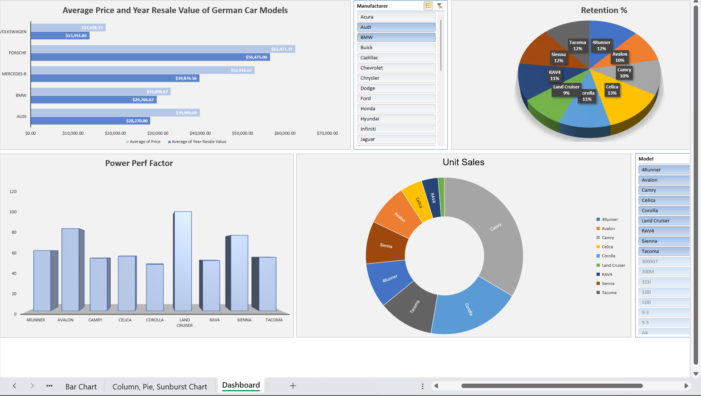

# 📊 Dashboard Setup in Excel

Designing insightful and interactive dashboards — transforming data into clear visual stories!  

---

## ✅ What I Learned
- How to set up a basic dashboard in Excel.
- Adding and arranging multiple chart types: **Column**, **Pie**, **Sunburst**, and **Bar charts**.
- Using **Slicers** to make dashboards interactive.
- Configuring dashboard layout for better readability and user experience.
- Customizing chart elements: titles, labels, and filters.

---

## 📌 Practice Files
| File Name | Description |
|-----------|-------------|
| [Lab9.xlsx](https://github.com/shwqh/my-data-path/raw/main/Excel-Labs/Lab9.xlsx) | Contains the complete dashboard setup including various charts and slicers arranged in a clean layout. |

---

## 🖼️ Dashboard Preview
  
---

## 💡 Notes
> Every dashboard I create brings me closer to building real, impactful data solutions — step by step, skill by skill! 🚀📈

