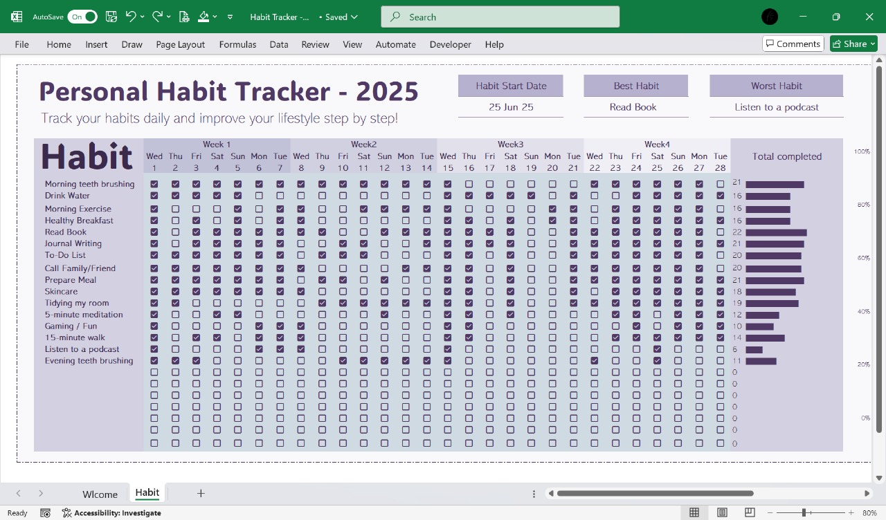
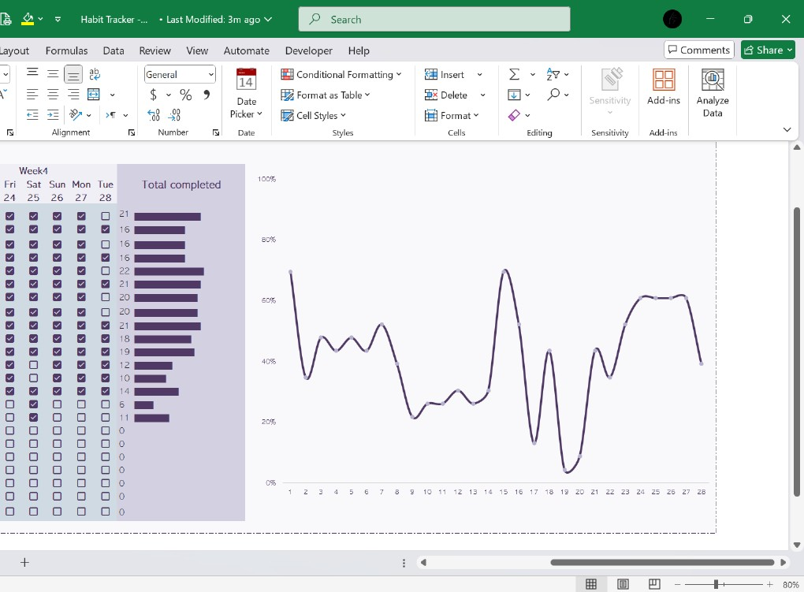

## 📋 Habit Tracker - 2025

This project includes a **Personal Habit Tracker** built with Excel to help you track daily habits and visualize progress over time.

### ✨ Key Features:
- Track your daily habits for 4 weeks.
- Automatic calculation of total completion for each habit.
- Identifies the **Best Habit** and **Worst Habit** based on completion rates.
- Interactive charts to visualize progress trends.
- Fully editable for personal use only (commercial use or resale is not allowed).

---

### 📸 Screenshots

#### ✅ Habit Tracking Page

This sheet allows you to:
- Record your daily habit performance across 4 weeks.
- Easily check off completed habits using checkboxes.
- View a summary of total completions for each habit in a bar chart.
- See your **Best Habit** and **Worst Habit** based on completion automatically.

---

#### 📊 Graph Page

This sheet provides:
- Daily summary of completed habits.
- A **line chart** representing habit completion trends over the tracked period.
- Visual feedback on how consistent you’ve been throughout the weeks.

---

### 📂 Excel File

The attached Excel file includes all sheets shown above and is ready for personal customization and use.

